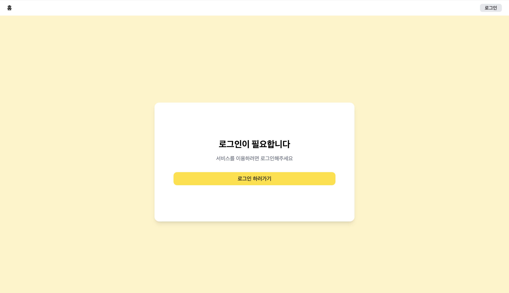
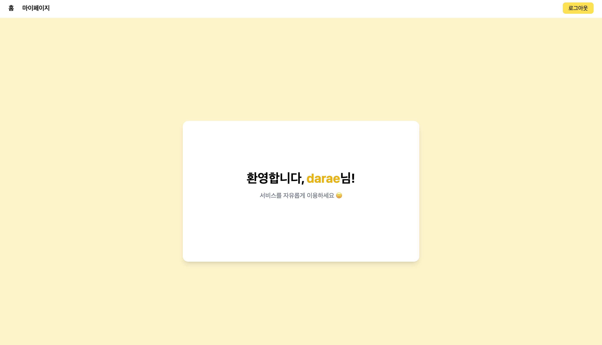
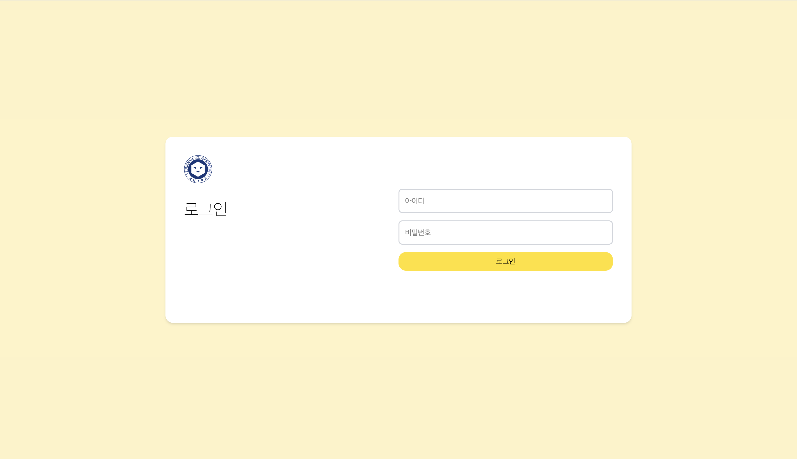
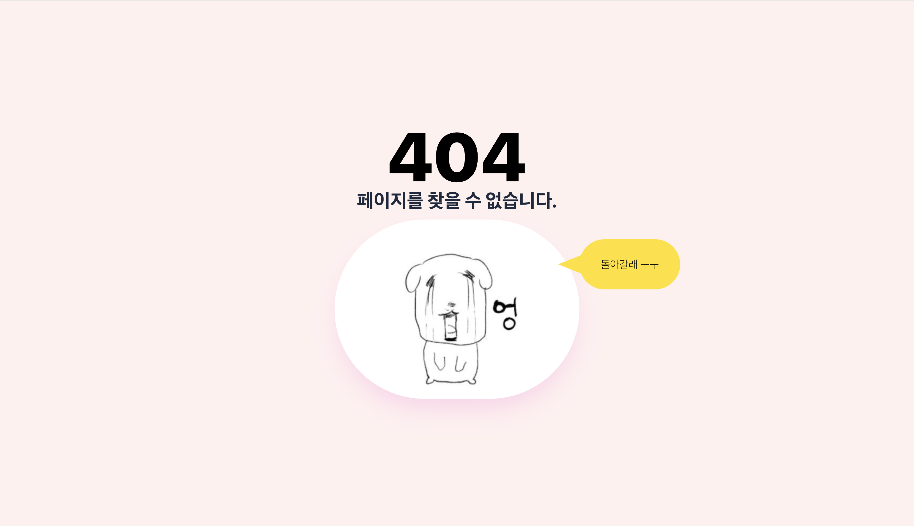

# 14th-fe-assignment-6
영남대 멋쟁이사자처럼 14기 프론트엔드 트랙 6차시 과제

## 완성본
### 로그인 전/home (/) 화면

### 로그인 후/home (/) 화면

### 로그인 화면

### 404 NotFound 화면


## 구현 과정

### 전체 구조
```App
 └── Routes
      ├── Layout (Navbar 있음)
      │     ├── / (Home)
      │     └── /mypage
      │
      ├── /login (Navbar 없음)
      └── /NotFound (Navbar 없음)
```

### 로그인 과정
1. 사용자가 로그인 폼 제출
2. registerUser(formData) 실행
3. 성공하면
4. 2초 기다림
5. 홈(/)으로 이동
6. username 같이 전달
7. 뒤로가기 막음 (replace)

```
setTimeout(() => {
        navigate('/', {
          state: { username: formData.username },
          replace: true
        });
      }, 2000);
```
-> setTimeout 2초


### 재실행시 로그인 상태 유지 문제 

로그인 시 `localStorage.setItem("user", JSON.stringify({ username: "darae" }));` 이렇게 브라우저에 데이터를 저장하는데, 이 때
localStorage 특징 
* 브라우저 꺼도 안 사라짐
* 새로고침해도 유지됨
* npm run dev 다시 실행해도 그대로 있음
* 직접 지우기 전까지 계속 남음   
떄문에 재실행시 로그인 정보를 삭제 해줘야 했다.   
 
 
따라서 `localStorage.removeItem("user");` 이 내용을 추가하여
"user"키를 완전히 삭제하는 법을 이용했다.

### 로그아웃 구현
추가적으로 
``` 
localStorage.removeItem("user");
window.location.href = "/";
```
브라우저에 저장해둔 로그인 정보를 삭제하여 로그아웃 기능을 구현해봄.

### 아무것도 입력하지 않아도 로그인되는 오류
원인: 입력값 체크 없이 setItion 하고 있어서 빈 값도 통과된 것.
```     if (!formData.username || !formData.password || !formData.username.trim() || !formData.password.trim()) 
 ```
위와 같이 빈 값이거나 ' '처럼 공백값을 입력했을 시 로그인이 되지 않도록 함.

#### 새로 알게된 것

- `e.preventDefault();`
:  form 제출하면 원래 페이지 새로고침 되는 거 막음

- `font-black`
: tailwind식 font-weight: 900 (굵게)

- `select-none`
: 텍스트 선택 방지

- `z-0`
: 레이어 순서 (뒤쪽 기준값)